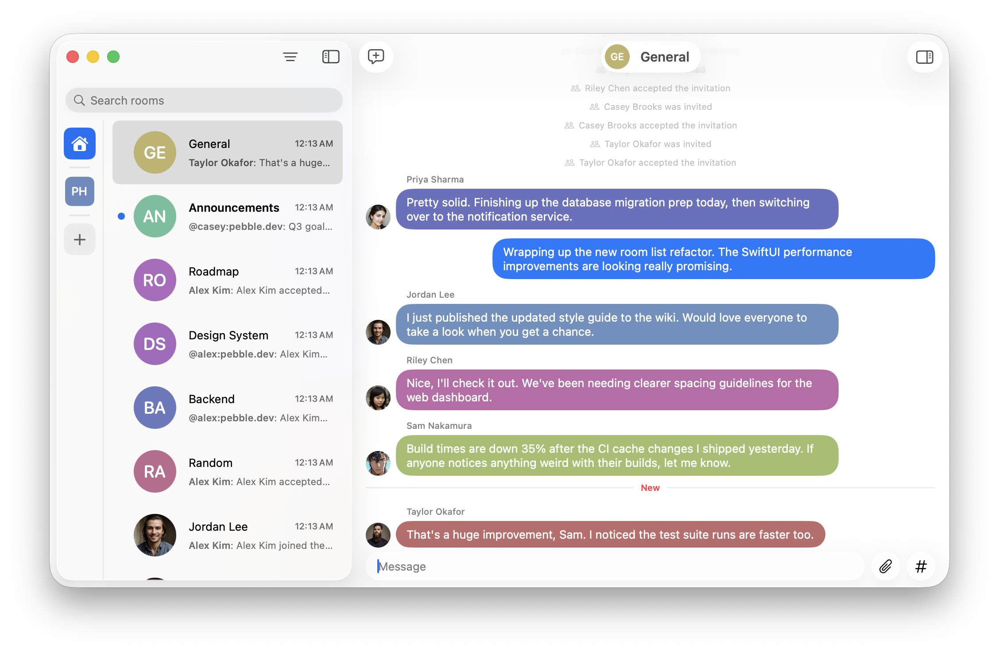

Relay - All the power of Matrix. None of the complexity.

A native macOS chat app built with SwiftUI that wraps the [Matrix Rust SDK](https://github.com/matrix-org/matrix-rust-sdk) via UniFFI-generated Swift bindings. Relay aims to feel like a first-class Mac app — fast, simple, and user-friendly — while speaking the Matrix protocol under the hood.

## Feature Overview

- **Room list & navigation** — browse joined rooms with unread counts, avatars, sorting, and filtering.
- **Rich timeline** — text, emote, notice, image, video, audio, and file messages with proper grouping, date headers, sender avatars, and big emoji for emoji-only messages.
- **Rich text rendering** — messages display formatted bodies with interactive, clickable mentions.
- **Message editing** — edit previously sent messages.
- **Message redaction** — delete messages.
- **Reactions** — toggle emoji reactions via context menu, emoji picker, or long-press.
- **Replies** — swipe on a message to reply, rendered as overlapping bubbles with click-to-jump.
- **Pin messages** — pin and unpin messages, view pinned messages, and jump to them in the timeline.
- **URL previews** — link previews displayed as standalone cards alongside messages.
- **Unread markers** — a "New" divider appears at the first unread message with jump-to support.
- **Attachments** — stage images and files before sending via drag-and-drop, paste, or the attach button.
- **GIF search** — search and send GIFs via GIPHY.
- **Username autocomplete** — mention users with inline suggestions while composing.
- **Typing indicators** — see who is currently typing in a room.
- **Room directory & room creation** — discover and join public rooms or create new ones.
- **Room details** — view and inspect room name, topic, and members.
- **Deep links** — handle `matrix:` URLs and `matrix.to` links to open rooms directly.
- **Direct messages** — start a DM with any user from their profile.
- **Infinite scrollback** — paginate backwards through history with a single click.
- **Auto-scroll** — the timeline stays pinned to the bottom for new messages, but won't interrupt you if you've scrolled up.
- **Session verification** — verify new sessions with a redesigned in-app flow.
- **Keychain-backed sessions** — login credentials are stored securely in the macOS Keychain.

## Roadmap

- 🧵 Thread support
- 🔔 Notification sync

# Try It Out

Relay is currently delivering prerelease builds through Test Flight. Join the
[Matrix room](https://matrix.to/#/#relayapp:matrix.org) to get an invite URL.

# Get Involved

Join us in the Matrix room to ask questions, discuss ideas, or just say hello:

[#relayapp:matrix.org](https://matrix.to/#/#relayapp:matrix.org)

# License

Code is licensed under the Apache 2.0 license. See the [LICENSE](./LICENSE) file for details.
Digital artwork is licensed under the Creative Commons Attribution-ShareAlike 4.0 International license. See the [LICENSE-CC-BY-SA](./LICENSE-CC-BY-SA) for details.

---

Made with ❤️. Fueled by ☕️ and 🤖.
